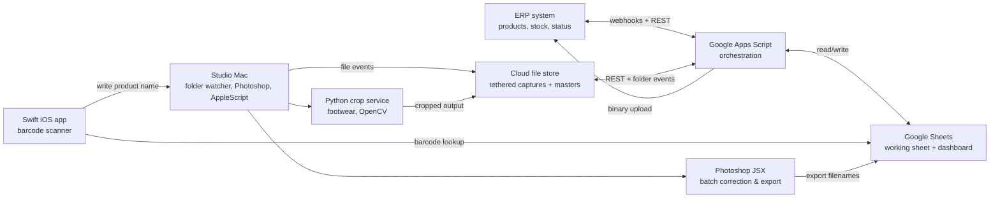

# Architecture

This document describes the technical shape of the studio automation system: the integration topology, why it was built on Google Apps Script rather than a more conventional server, and the principal trade-offs that shaped each component.

---

## High-level diagram

The system has no central server in the conventional sense. Apps Script acts as the orchestrator, triggered by time-based schedules and webhooks. The studio Mac runs the folder watcher and the heavy image-processing jobs. The iOS device is a barcode scanner that talks back to Apps Script over its REST endpoint.

---

## Why Apps Script

This is the question that comes up most often, so it goes first. A more conventional choice would have been a small Node.js or Python service running on a cheap VM, with a queue, a database, and a worker process.

Apps Script was chosen for four reasons:

1. **No infrastructure to maintain.** The studio had no developer team. Anything requiring a VM, an SSL certificate renewal, or a deployment pipeline would degrade the moment I left the role. Apps Script runs inside the same Google Workspace the company already paid for.
2. **The data already lived in Sheets.** The working sheet was where the studio coordinator already lived. Putting orchestration logic next to the data avoided an entire class of "what does the source of truth say" problems.
3. **The volume was right for it.** Apps Script has well-known limits — six-minute execution per trigger, daily quotas on API calls. The studio's volume (60–120 SKUs/day) sat comfortably inside those limits, with headroom.
4. **Failure modes are visible.** When an Apps Script execution fails, the operator sees the failure in the same sheet they already check every morning. There is no separate logging dashboard to monitor.

The trade-off: Apps Script is not how you would build this for a 10,000-SKU/day operation. If the studio scaled past roughly 500 SKUs/day, the orchestration layer would need to move. The system was designed with that migration path in mind — every Apps Script function calls a thin adapter layer, so replacing the runtime would mean replacing the adapter, not rewriting the logic. This is documented in the source comments of `src/asset-workflow/apps-script-sample.js`.

---

## Component-by-component

### The working sheet (Google Sheets)

The single source of truth. One row per SKU per shoot day, with columns for: ERP product ID, brand, category, expected deliverables, capture status, post-production status, export status, ERP upload status, error notes. Conditional formatting paints each row by overall state.

The sheet has a fixed set of columns that scripts read by name, not by index. This is because the ERP team's export occasionally changed column order. Reading by name added a small amount of code (a header map built once per execution) and removed an entire class of failures.

### The orchestrator (Google Apps Script)

Three categories of triggers:

- **Time-based** — runs every fifteen minutes during studio hours to pull new ERP records, push completed records back to the ERP, and refresh the dashboard.
- **Sheet edit** — runs when a coordinator manually changes a status cell, used for exception handling.
- **HTTP** — exposes endpoints called by the iOS scanner and the studio Mac's folder watcher.

The orchestrator is split into modules: `erp_adapter.gs`, `sheet_adapter.gs`, `dropbox_adapter.gs`, `dedup.gs`, `dispatch.gs`. Each adapter wraps one external system; logic lives in the dispatch layer and never calls an external API directly. This is the migration-path design mentioned above.

### The folder watcher (studio Mac)

A small launchd job watches the cloud-store sync folder. When new files arrive, it:

1. Computes a perceptual hash (pHash) of the image
2. Looks up the SKU in the working sheet (by filename, written in by the iOS scanner)
3. Compares the new pHash against any existing image for that SKU
4. Writes a status row with a quality score derived from sharpness and exposure metrics

The quality score matters because re-shoots are common. A photographer might re-shoot an item if lighting was wrong on the first take. Without scoring, a worse second take could silently overwrite a better first take. With scoring, the second take is flagged "lower quality than existing — review before replacing."

### The barcode scanner (iOS, Swift)

The simplest and most operationally important component. Apple's Vision framework reads the barcode; a small SwiftUI interface displays the matched product; a tap writes the canonical product name into the photographer's tethered capture software via an HTTP call to a script running on the studio Mac, which then drives Capture One via AppleScript.

The first version of this was a Python script running on a laptop. It worked, but it required the laptop to be present at the shooting station. Moving to a phone-based scanner removed a piece of equipment from the studio floor. This is a small change that operators noticed immediately.

### The Photoshop batch (JSX)

Photoshop ExtendScript runs inside Photoshop and applies category-specific corrections: white balance against a known card, background masking, output sizing, file naming. The script reads category from a metadata sidecar that the folder watcher wrote, so corrections are deterministic — the same input file produces the same output file every time.

JSX is unfashionable. It is also stable: scripts written in 2021 still run on Photoshop 2026 with no changes. For a studio that cannot afford to debug a tooling regression on a deadline day, that stability is worth a lot.

### The crop service (Python, OpenCV)

Footwear has tighter composition requirements than apparel. The Python service applies a trained classifier that finds the shoe within the frame, computes a target crop based on shoe orientation, and writes the cropped output. The model itself is not in this repo — it was trained on internal product photography. The pipeline structure is in `src/image-processing/shoe-crop-sample.py`.

---

## What this architecture does not do

A few things are deliberately absent:

- **No database.** The working sheet is the database. This is a constraint, not an oversight.
- **No queue.** Apps Script's time-based triggers act as a poor-man's queue. For this volume, that is sufficient.
- **No CI/CD.** Apps Script is edited in a browser. Version control is via a manual export to GitHub. This is honestly the weakest part of the system; it is also a problem inherent to Apps Script.
- **No formal automated test suite.** Validation was done through staged dry-runs, small-batch rollouts, visible error states surfaced in the working sheet, and reversible manual fallbacks at every external write. For a larger-scale environment, automated tests and CI would be necessary; the validation strategy described here is sized to the volume and reversibility characteristics of this specific operation.

The architecture document closes here because the design philosophy is the actual point: every component was chosen because it could be maintained by a single non-developer operator after the original author left the role. That constraint, more than any technology choice, is what makes the system the shape it is.
